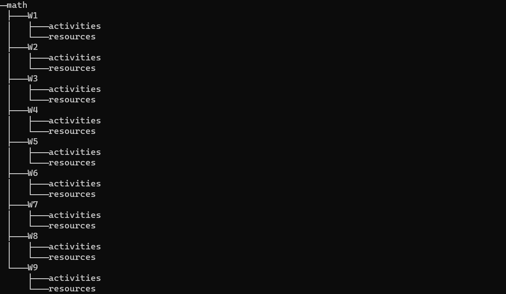

- [Python Functionality Scripts](#python-functionality-scripts)
  - [Scripts Documentation](#scripts-documentation)
    - [Download From Youtube](#download-from-youtube)
      - [How to use it?](#how-to-use-it)
      - [How to get video/playlist url ](#how-to-get-videoplaylist-url-)
    - [Get wifi keys](#get-wifi-keys)
      - [How to use it?](#how-to-use-it-1)
    - [Remove Empty Folders](#remove-empty-folders)
      - [How to use it?](#how-to-use-it-2)
    - [Create Classes Folders](#create-classes-folders)
      - [How it works?](#how-it-works)
      - [How to use it?](#how-to-use-it-3)
    - [About default values](#about-default-values)
      - [download\_from\_youtube.py ](#download_from_youtubepy-)
      - [get\_wifi\_keys.py ](#get_wifi_keyspy-)
  - [How to run the scripts ](#how-to-run-the-scripts-)


# Python Functionality Scripts

Some scripts that I've made as a personal project to fulfill some of my needs. Feel free to use any of these scripts if they are somewhat useful for you.

## Scripts Documentation

### Download From Youtube

A script to download a single video or an entire playlist from youtube as audio or video.

#### How to use it?

- Run the scripts [how?](#howToRunTheScripts)
- Select option 'a'
- Select what to download, either a video or playlist
- Copy the video/playlist url from youtube [how?](#howToGetVideoPlaylistUrl)
- Paste the video/playlist url to the command line
- Select the format in which you want to download it, either audio or video 
- Write the path in which you want to save the files (blank for default) [more](#defaultsDownloadFromYoutube)
- Write the video name (blank for default) [more](#defaultsDownloadFromYoutube)
- Wait until it downloads

> In order to select an option either by letter or number just write the letter or number corresponding to that option

#### How to get video/playlist url <a id="howToGetVideoPlaylistUrl"></a>

- Open youtube
- Lookup for the video or playlist that you want to download
- If it is a video:
  - Click on the share button right after the dislike button
  - On the popup window click on "copy"
  - URL example: https://youtu.be/U0CGsw6h60k
- If it is a playlist:
  - Click on the playlist name to open the playlist page
  - Copy the url from the search bar
  - URL example: https://www.youtube.com/playlist?list=PLMC9KNkIncKtPzgY-5rmhvj7fax8fdxoj

### Get wifi keys

A script to get wifi keys from the terminal and store them on a .txt file.

> This is NOT a script to hack into near wifi networks and get the passwords; it will just get the saved wifi passwords from your computer, also keep in mind that this won't work for all passwords.

#### How to use it?

- Run the scripts [how?](#howToRunTheScripts)
- Select option 'b'
- Wait until the script automatically generates a pwd.txt file [more](#defaultsGetWifiKeys)

### Remove Empty Folders

A script to remove empty folders recursively based on a starting path entered by the user.

#### How to use it?

- Run the scripts [how?](#howToRunTheScripts)
- Select option 'c'
- Enter the path from where you want to remove empty folders recursively
- Wait until all folders are removed

### Create Classes Folders

A script to create the folders of a university class. The purpose of this script is to dynamically create all the folders needed for my university classes at the beginning of each period, I'm uploading it because I think that It might be useful for someone else.

#### How it works?

The script will ask you to enter the amount of classes that you want to create and the amount of weeks that you want for each class. In my case each university period last for 3 months or 10 weeks, and for every week I want to have a folder for the resources of that week and another one for the activities. So for the sake of this explanation, let's assume that I create a directory for the "math" class with 9 weeks, the resulting output will look something like this:



It creates a folder with the name of the class, which in this case is "math"; and inside that folder we have 1 folder for each week, which in turn will also have 2 folders, 1 for the activities and 1 for the resources. Every week folder inside the class will have its number right after the letter "W". 

#### How to use it?

- Run the scripts [how?](#howToRunTheScripts)
- Select option 'd'
- Enter the path in which you want to create the classes
- Enter the amount of class directories that you want to create
- Enter the amount of weeks that you want to create for each class
- For each class that you want to create, it will ask you to enter the name of it
- Wait until all folders are created

### About default values

#### download_from_youtube.py <a id="defaultsDownloadFromYoutube"></a>

- The default path for a single video as .mp3 is: .\Audio
- The default path for a single video as .mp4 is: .\Video
- The default path for the videos of a playlist is: .\\{playlist}, where {playlist} stands for the playlist name
- The default file name will always be the name of the video in lower case and using "_" instead of spaces

#### get_wifi_keys.py <a id="defaultsGetWifiKeys"></a>

- The default path in which the pwd.txt file will be saved is: .\

> ".\\" means the current folder in which you're executing the script

## How to run the scripts <a id="howToRunTheScripts"></a>

- [Clone the repository](https://docs.github.com/en/repositories/creating-and-managing-repositories/cloning-a-repository) or download it
- [Download python](https://www.python.org/downloads/) and install it if you don't have it already
- Open the folder with the repository code and right click on it
- Click on the "Open in Terminal" option
- On your terminal write ```py .\run_scripts.py```